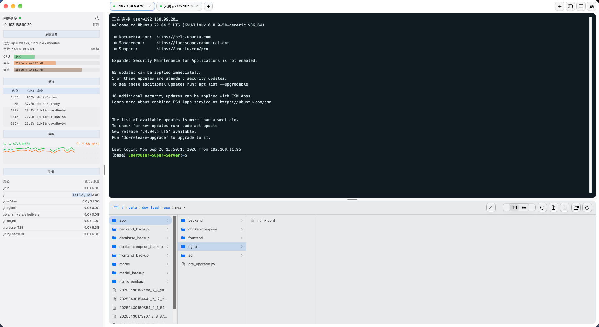

# HuShell

HuShell 是面向 macOS 的原生 SSH / SFTP 工作台。

**改版自 FinalShell 的使用体验与功能布局，使用 SwiftUI / AppKit 独立实现。** 项目参考 FinalShell 的多连接终端、主机监控和远端文件管理交互，并采用适合 macOS 的简约界面与玻璃材质；此说明指功能和界面参考关系，不表示本项目使用了 FinalShell 的应用源代码。

## 界面预览



## 功能

- **多标签 SSH 终端**：支持用户名 / 密码、SSH Agent 和私钥；标签右键可重连、复制、关闭。
- **连接管理**：搜索、新建、编辑、删除连接；支持嵌套分组、重命名和删除分组。编辑时可选择已有分组，也可输入新分组。
- **最近连接**：快速连接页面默认展示最近连接，按连接时间倒序排列；普通分组和连接按名称排序。
- **主机信息**：展示负载、CPU、内存、交换空间、进程、网络流量和磁盘挂载点，侧栏可见时每 3 秒刷新。
- **远端文件管理**：列表 / 分栏视图，绝对路径节点导航和手动输入路径；支持上传、下载、Finder 拖入文件、打包传输、新建、重命名、删除和权限修改。
- **传输查看器**：显示上传 / 下载任务的进度、速度、已传大小与结果。
- **独立文本编辑器**：多个文件标签、查找、保存到远端、未保存提示。信息工具栏默认隐藏，服务器和路径显示在窗口标题中。
- **macOS 布局**：中文菜单、可隐藏的主机和文件面板、可拖动分隔栏、文件面板底部 / 右侧布局、启动自动最大化。macOS 26 及以上使用系统玻璃效果，较早版本使用透明材质。

## 构建与运行

需要 Apple Silicon Mac、macOS 14 或更高版本，以及支持源码所用 SwiftUI API 的 Xcode / 命令行工具。

```sh
./build-app.sh
open build/HuShell.app
```

构建脚本当前生成 `arm64` 应用，并进行本机临时签名，未进行 Apple 公证。也可以使用 `swift build` 构建可执行文件。

应用图标由 `Assets/make-icon.swift` 绘制，结合 H 字母与 `>_` 终端提示符。

## 使用

启动或点击标签旁的 `+` 进入快速连接页面，默认选中“最近连接”。双击条目连接服务器。可以从“全部连接”或普通分组中查找未连接过的服务器；`⌘T` 新建连接列表标签，`⇧⌘N` 新建连接。

右键普通分组可重命名或删除。删除分组和子分组后，其连接及密码保留，连接移至“未分组”。

远端文件路径支持点击节点跳转，双击路径可输入或粘贴目录。双击不超过 50 MB 的受支持 UTF-8 文本文档，会在独立编辑窗口打开；其他文件下载后交给本机应用。编辑器支持 `⌘S` 保存、`⌘F` 查找、`⌘W` 关闭当前文件，右上角菜单可显示信息工具栏。

上传拖放当前支持文件，不支持文件夹。普通删除仅能删除空目录，快速删除递归删除，操作前会提示确认。

## 本地数据与密码

应用数据保存在 `~/Library/Application Support/HuShell/`：

| 文件 | 内容 |
| --- | --- |
| `connections.json` | 连接资料与分组归属 |
| `groups.json` | 分组配置 |
| `recent-connections.json` | 最近连接时间 |
| `credentials.vault` | 加密密码 |
| `credentials.key` | 本地加密密钥 |

密码使用本地 AES-GCM 加密文件保存，不使用 macOS 钥匙串。正常连接无需输入主密码；只有“查看已保存密码”需要主密码验证。主密码用于密码显示验证，不用于解锁自动连接所需的本地数据密钥。密码文件与密钥使用 `0600` 权限；能读取这两个文件的本机账户仍能解密密码。

SSH / SFTP 子进程通过临时本机 Unix socket 获取凭据。SSH 主机密钥遵循 OpenSSH 的 `accept-new` 策略，已知主机密钥变化会导致连接失败。

连接配置、实际密码、密钥和连接历史属于用户本地数据，不包含在本仓库中。

## 导入 FinalShell

应用提供命令行导入入口，支持密码方式的 SSH 连接及文件夹分组：

```sh
build/HuShell.app/Contents/MacOS/HuShell --import-finalshell "$HOME/Library/FinalShell/conn"
```

导入时在本机解码密码，再保存到 HuShell 的加密保险库；保留原有连接并备份现有本地数据。同一来源连接重复导入不会重复添加。当前不导入其他连接类型或私钥认证配置。

FinalShell 密码格式解码参考：[jas502n/FinalShellDecodePass](https://github.com/jas502n/FinalShellDecodePass)。

## 测试

```sh
swift test --disable-sandbox
```

测试覆盖凭据保险库、凭据代理、远端文件策略、主机统计、FinalShell 导入，以及分组管理和最近连接持久化。

## 第三方组件

终端使用 xterm.js 与 FitAddon。许可证保存在 `Sources/HuShell/Resources/XTERM-LICENSE` 和 `ADDON-FIT-LICENSE`。
